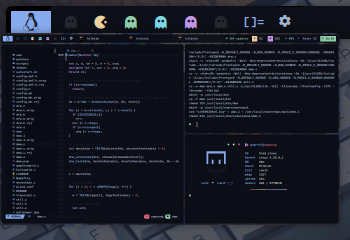

<!-- inspired by rxyhn's readme -->

<!-- RICE PREVIEW -->
<div align="center">
   <a href="#--------">
      
   </a>
</div>

<br>

<!-- BADGES -->
<h1>
  <a href="#--------">
    
  </a>
  <a href="#--------">
    
  </a>
</h1>

<br>

## Hi there! Thanks for dropping by! :blue_heart:
<b>  AlphaTechnolog's DWM Rice  </b>

Welcome! This is the repository for my dwm rice using [decay](https://github.com/decaycs) (decayce variant)

## ‎ <samp>Notice! ⚠️</samp>

If you like this configuration, please give me a star in this repo, it will make me more happy! 😁
> If you want, you can visit [more of my repos](https://github.com/AlphaTechnolog?tab=repositories) or go to [my profile](https://github.com/AlphaTechnolog)
> Ah, and gimme credits if you will use my config for showcase :3

> See other branches to go to others/olders rices.

## ‎ <samp>Information ℹ️</samp>

Here are some details about my setup:


- **OS:** [Void Linux](https://voidlinux.org)
- **WM:** [dwm](https://dwm.suckless.org)
- **Terminal:** st (Configuration/Build included in `cfg`)
- **Shell:** [hilbish](https://github.com/Rosettea/Hilbish)
- **Editor:** [neovim](https://github.com/neovim/neovim)
- **NeovimConfig**: [nvcodark](https://github.com/AlphaTechnolog/nvcodark) (I'm using the remake that is present in the dev branch, instructions aren't ready yet, main branch is broken)
- **Compositor:** [picom](https://github.com/yshui/picom)
- **Application Launcher:** [rofi](https://github.com/davatorium/rofi)

## ‎ <samp>Setup ✏️</samp>

### Clone the repository

First clone the repository

```sh
git clone -b dwm https://github.com/AlphaTechnolog/dotfiles
cd dotfiles
```

### Requirements ✅

Then make sure you have the next requirements installed

This is in testing phase btw, if you think i miss some pkg, please tell me it opening an [issue](https://github.com/AlphaTechnolog/dotfiles/issues/new)

#### Fonts

| **font** | **utility** |
|----------|-------------|
|[JetBrainsMono Nerd Font](https://nerdfonts.com/font-downloads)|Some icons|

#### Dependencies

| **dependency** | **utility** |
|----------------|-------------|
|picom|The compositor, i'm using the [Arian8j's picom fork](https://github.com/Arian8j2/picom)|
|hilbish|The shell (see my [configuration documentation](../cfg/hilbish) if you want of course.)|
|bat|Enhanced cat|
|exa|Enhanced ls (using for tree too)|
|rofi|Apps launcher|
|playerctl|Remotely music management (needs to use dbus, use dbus-run-session if your session isn't started with dbus)|
|light|Manage the brightness using the cli|
|pulseaudio|Well, just the audio manager|
|pactl|Manage pulseaudio using the cli|
|dunst|Notifications Daemon|
|eww|Widgets|

### Copy the configs

**WARNING**: Configuration files present in the next paths might be overrided.

#### Create folders

First create folders if they aren't still there.

```sh
test -d ~/.config || mkdir -p ~/.config
test -d ~/.local/bin || mkdir -p ~/.local/bin
```

#### Install My Patched CartographCF Nerd Font

You have to install my self-patched CartographCF Nerd Font, it's used in this rice to the main UI stuff and the terminal too.

```sh
sudo cp -r ./fonts/CartographCF\ Nerd\ Font/* /usr/share/fonts
```

#### Install Material Icons

Material Icons are needed to render the pac-man taglist, i included the fonts in this repository too.

```sh
sudo cp -r ./fonts/MaterialIcons/* /usr/share/fonts
```

#### Copy dotfiles

Then, just copy the config files to the appropiate folders.

```sh
cp -r ./cfg/* ~/.config
cp -r ./bin/* ~/.local/bin
cp -r ./home/.Xresources ~
```

### Compile dwm

You have to compile my build of dwm that's just the build of the window manager used in this rice :>

```sh
cd ~/.config/dwm
sudo make clean install
```

> You will get compilation errors that just shows what packages you have to install to
> finish the compilation process, just read a bit the error and install the needed package/lib for your os.

### Gtk-Theming

Here are some details about my Gtk-Config.

- **Gtk Theme**: [decay](https://github.com/decaycs/gtk3)
- **Icons**: [decay-icons](https://github.com/decaycs/decay-icons)
- **Cursor**: Breeze Snow.

### Galery

Just some screenshots to explore more the appearance/stuff of this AwesomeWM config.

#### The Desktop


#### Simple-Dashboard


#### Tags Preview



#### Rofi (Apps Launcher)


#### Simple Bar


### Enjoy ❤️

That's all! Now enjoy with this configuration!

## ‎ <samp>Tips 😎</samp>

### Some keyboards shortcuts

| **shortcut** | **meaning** |
|--------------|-------------|
|super + shift + return|Open rofi|
|super + m|Maximize window|
|super + {j,k}|Move Window Focus|
|super + {h,l}|Resize the window|
|super + shift + q|Quit dwm|
|super + shift + r|Restart dwm|
|super + w|Close window|
|super + Tab|Cycle layouts|
