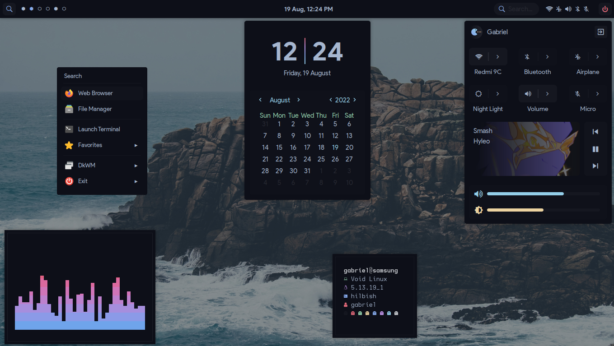
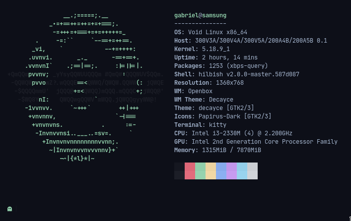

<!-- inspired by rxyhn's readme -->

<!-- RICE PREVIEW -->
<div align="center">
   <a href="#--------">
      
   </a>
</div>

<br>

<!-- BADGES -->
<h1>
  <a href="#--------">
    
  </a>
  <a href="#--------">
    
  </a>
</h1>

<br>

## Hi there! Thanks for dropping by! :blue_heart:
<b>  AlphaTechnolog's bspwm Rice  </b>

Welcome! This is the repository for my bspwm rice using my own theme called decay (darker version)

## ‎ <samp>Notice! ⚠️</samp>

If you like this configuration, please give me a star in this repo, it will make me more happy! 😁

> If you want, you can visit [more of my repos](https://github.com/AlphaTechnolog?tab=repositories) or go to [my profile](https://github.com/AlphaTechnolog)

## ‎ <samp>Information ℹ️</samp>

Here are some details about my setup:



- **OS:** [Void Linux](https://voidlinux.org)
- **WM:** [bspwm](https://github.com/baskerville/bspwm)
- **Terminal:** [st](https://st.suckless.org/)
- **Shell:** bash
- **Editor:** [neovim](https://github.com/neovim/neovim)
- **NeovimConfig**: [nvcodark](https://github.com/AlphaTechnolog/nvcodark) and [nvchad](https://github.com/NvChad/NvChad)
- **Compositor:** [picom](https://github.com/yshui/picom)
- **Application Launcher:** [rofi](https://github.com/davatorium/rofi)

> I know, i know, my kernel is too old, but i can't update it in void (because newer isn't released yet i think) ☹️

<!-- SETUP -->
## ‎ <samp>Setup ✏️</samp>

### Clone the repository

First clone the repository

```sh
git clone https://github.com/AlphaTechnolog/dotfiles-v2
cd dotfiles-v2
```

### Requirements ✅

Then make sure you have the next requirements installed

> This is in testing, if you think that i miss some pkg, please tell me it using my discord (alphatechnolog#6570) or opening an [issue](https://github.com/AlphaTechnolog/dotfiles-v2/issues/new)

#### Fonts

| **font** | **utility** |
|----------|-------------|
|Iosevka Nerd Font|Bar font|
|CaskaydiaCove Nerd Font|General Font|

> [Download site](https://www.nerdfonts.com/font-downloads)

#### Dependencies

| **dependency** | **utility** |
|----------------|-------------|
|bspwm|The window manager|
|sxhkd|The hotkeys daemon|
|picom|The compositor|
|bash|The shell|
|starship|With starship you can customize the prompt of any shell|
|feh|Set wallpaper and image viewer|
|bat|Enhanced cat|
|exa|Enhanced ls (using for tree too)|
|dunst|Customizable notifications|
|rofi|Apps launcher|
|playerctl|Remotely music management|
|light|Manage the brightness using the cli|
|iwgetid|Get the connected wifi SSID|
|amixer|Manage the audio|

> You can use the pkg for install the mayority of the pkgs

### Copy the configs

**WARNING**: Configuration files may be overrided.

```sh
cp -r ./cfg/* ~/.config
cp -r ./bin/* ~/.local/bin
cp -r ./home/bashrc ~/.bashrc
cp -r ./home/Xresources ~/.Xresources
```

### Compile st

Compile my build of st (this is the default terminal, but you can change it in the sxhkd configuration):

```sh
cd ~/.config/st
rm config.h && sudo make clean install
```

> It could throws some errors, make sure you have the correct dependencies for st like `harfbuzz` and `imlib2` (if not luck, try installing the `-dev` or `-devel` pkgs)

### Enjoy ❤️

That's all! Now enjoy with this configuration!

## ‎ <samp>Tips 😎</samp>

If you want to open neovim without padding in st terminal, you can use `nv` instead of `neovim` (because in [bin](../bin) i put the `nv` script)
