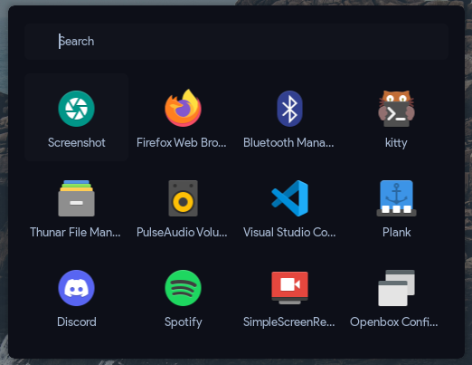

<!-- inspired by rxyhn's readme -->

<!-- RICE PREVIEW -->
<div align="center">
   <a href="#--------">
      
   </a>
</div>

<br>

<!-- BADGES -->
<h1>
  <a href="#--------">
    
  </a>
  <a href="#--------">
    
  </a>
</h1>

<br>

## Hi there! Thanks for dropping by! :blue_heart:
<b>  AlphaTechnolog's AwesomeWM Rice  </b>

Welcome! This is the repository for my awesomewm rice using [decay](https://github.com/decaycs) (decayce variant)

## ‎ <samp>Notice! ⚠️</samp>

If you like this configuration, please give me a star in this repo, it will make me more happy! 😁
> If you want, you can visit [more of my repos](https://github.com/AlphaTechnolog?tab=repositories) or go to [my profile](https://github.com/AlphaTechnolog)
> Ah, and gimme credits if you will use my config for showcase :3

> See other branches to go to others/olders rices.

## ‎ <samp>Information ℹ️</samp>

Here are some details about my setup:


- **OS:** [Void Linux](https://voidlinux.org)
- **WM:** [AwesomeWM](https://github.com/awesomeWM/awesome)
- **Terminal:** st (Configuration/Build included in `cfg`)
- **Shell:** [hilbish](https://github.com/Rosettea/Hilbish)
- **Editor:** [neovim](https://github.com/neovim/neovim)
- **NeovimConfig**: [nvcodark](https://github.com/AlphaTechnolog/nvcodark) (I'm using the remake that is present in the dev branch, instructions aren't ready yet, main branch is broken)
- **Compositor:** [picom](https://github.com/yshui/picom)
- **Application Launcher:** [rofi](https://github.com/davatorium/rofi)

## ‎ <samp>Setup ✏️</samp>

### Clone the repository

First clone the repository

```sh
git clone -b awesomewm https://github.com/AlphaTechnolog/dotfiles
cd dotfiles
```

### Requirements ✅

Then make sure you have the next requirements installed

This is in testing phase btw, if you think i miss some pkg, please tell me it opening an [issue](https://github.com/AlphaTechnolog/dotfiles/issues/new)

#### Fonts

| **font** | **utility** |
|----------|-------------|
|[Product Sans (Google Sans)](https://www.cufonfonts.com/font/google-sans)|Main UI Font|
|[JetBrainsMono Nerd Font](https://nerdfonts.com/font-downloads)|Some icons, others are rendered using svg|
|[RobotoMono Nerd Font](https://nerdfonts.com/font-downloads)|Terminal font|

#### Dependencies

| **dependency** | **utility** |
|----------------|-------------|
|AwesomeWM|The window manager (Use the **git** version)|
|picom|The compositor, i'm using the [Arian8j's picom fork](https://github.com/Arian8j2/picom)|
|hilbish|The shell (see my [configuration documentation](../cfg/hilbish) if you want of course.)|
|bat|Enhanced cat|
|exa|Enhanced ls (using for tree too)|
|rofi|Apps launcher|
|playerctl|Remotely music management (needs to use dbus, use dbus-run-session if your session isn't started with dbus)|
|light|Manage the brightness using the cli|
|pulseaudio|Well, just the audio manager|
|pactl|Manage pulseaudio using the cli|
|maim|Take screenshots|
|dunst|Notifications are made using AwesomeWM naughty module, but screenshot script actions buttons are made with dunstify (still trying to replace dunstify with another program/tool)|

### Copy the configs

**WARNING**: Configuration files present in the next paths might be overrided.

#### Create folders

First create folders if they aren't still there.

```sh
test -d ~/.config || mkdir -p ~/.config
test -d ~/.local/bin || mkdir -p ~/.local/bin
```

#### Copy dotfiles

Then, just copy the config files to the appropiate folders.

```sh
cp -r ./cfg/* ~/.config
cp -r ./bin/* ~/.local/bin
cp -r ./home/.Xresources ~
```

### Compile Simple Terminal (st)

My Simple-Terminal build is based on [siduck's one](https://github.com/siduck/st), this config is included in the `cfg` folder btw.

Just do this before log-in using AwesomeWM.

#### Install requirements

**Void Linux**

- pkg-config
- gcc
- harfbuzz-devel
- libXft-devel
- libX11-devel
- libXext-devel
- libXrender-devel
- libXinerama-devel
- gd-devel

**Debian (and ubuntu probably)**

- build-essential
- libxft-de
- libharfbuzz-dev

Some snippets here:

> `sudo xbps-install pkg-config gcc harfbuzz-devel libXft-devel libX11-devel libXext-devel libXrender-devel libXinerama-devel gd-devel`

> `sudo apt install build-essential libxft-de libharfbuzz-dev`

#### Run Compilation Process

Execute the next commands:

```sh
cd ~/.config/st
test -f config.h ; sudo rm config.h
sudo make clean install
```

> Then st should be installed globally automatically.

### Make powermenu buttons work.

Maybe the powermenu buttons don't work (just the poweroff and reboot ones), that's because i'm using doas combined
with some configuration to make `poweroff` and `reboot` commands work without password (and because i like doas more than sudo).

So, you have to setup doas to make that buttons work. See the next steps:


#### Install doas

You can install doas in any operative system, just check your operative system documentation, i'll asume you're using void linux,
but this can be done using any operative system.

Install doas using the `opendoas` package (assuming that you're using Void Linux):

```sh
sudo xbps-install opendoas -y
```

Then just configure it a bit, edit the file using your preferred cli editor with root privileges, i'll use vim.

```sh
sudo vim /etc/doas.conf
```

> You can use nano, code, etc.

Put the next in that file:

```
permit persist :wheel
permit nopass root
permit nopass :wheel cmd poweroff
permit nopass :wheel cmd reboot
```

Then, if you aren't in the wheel group, include yourself there.

```sh
sudo usermod -aG wheel $(whoami)
```

That should be enough. Basically the `doas.conf` that we copied-pasted in `/etc/doas.conf`, do the next:

- allow users in the `wheel` group to elevate privileges.
- allow root user to elevate privileges with no-password (because root already has root privileges)
- allow users in the `wheel` group to execute the command `poweroff` without password.
- allow users in the `wheel` group to execute the command `reboot` without password.

If you want, you can test doas in your terminal.

```sh
doas echo hello
```

> That command should ask you for password.

```sh
doas poweroff
```

> That command shouldn't ask you for password, it just should turn off the pc.

```sh
doas reboot
```

> That command shouldn't ask you for password, it just should reboot the pc.

### Gtk-Theming

Here are some details about my Gtk-Config.

- **Gtk Theme**: [decay](https://github.com/decaycs/gtk3)
- **Icons**: [decay-icons](https://github.com/decaycs/decay-icons)
- **Cursor**: Breeze Snow.

### Galery

Just some screenshots to explore more the appearance/stuff of this AwesomeWM config.

#### The Desktop


#### Beautiful and Fully Functional Dashboard


#### Task preview (using bling)


#### Tags Preview (using bling)


#### Hover-Based Calendar


#### Rofi (Apps Launcher)



#### Simple Powermenu


#### Right-Click Simple Desktop Menu


#### Simple but Fully Functional/Useful Bottom Bar


#### Simple but useful systray popup (triggered with systray toggler button in bar)


### Enjoy ❤️

That's all! Now enjoy with this configuration!

## ‎ <samp>Tips 😎</samp>

### Wallpaper

If you just want the wallpaper (lol), see [this file](../cfg/awesome/assets/wallpaper.jpg)

### Changing Profile Photo

If you want to change your profile photo in the powermenu,
replace [this file](../cfg/awesome/assets/pfp.png) with
your profile photo (use png or change the path in [theme.lua](../cfg/awesome/theme.lua))

### Some keyboards shortcuts

| **shortcut** | **meaning** |
|--------------|-------------|
|super + shift + return|Open rofi|
|super + m|Maximize window|
|super + {j,k}|Move Window Focus|
|super + {h,l}|Resize the window|
|super + shift + q|Quit AwesomeWM|
|super + ctrl + r|Restart AwesomeWM|
|super + w|Close window|
|super + Tab|Switch layouts|

> In the most of the cases, exists mouse based keybindings (but i really prefer the shortcuts lol)

### Bling

You can use the official bling module, but I made some modifications in the source code
of bling to add multimonitor support in some parts, it's recommended to use my own version (for this dotfiles at least),
but anyway you can use another version or modification of the bling module if you want
