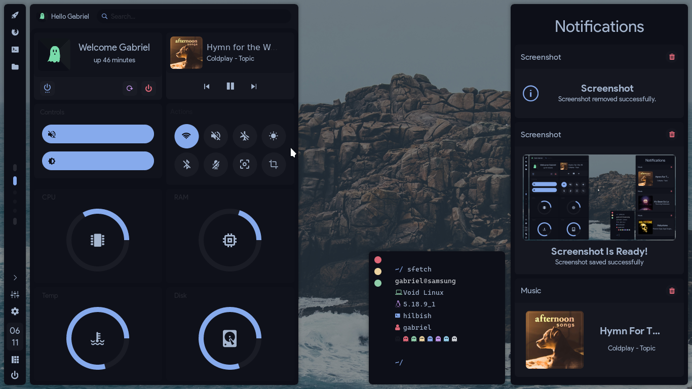
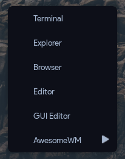
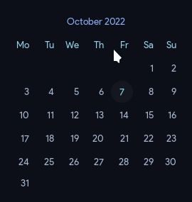

<!-- inspired by rxyhn's readme -->

<!-- RICE PREVIEW -->
<div align="center">
   <a href="#--------">
      
   </a>
</div>

<br>

<!-- BADGES -->
<h1>
  <a href="#--------">
    
  </a>
  <a href="#--------">
    
  </a>
</h1>

<br>

## Hi there! Thanks for dropping by! :blue_heart:
<b>  AlphaTechnolog's DkWM Rice  </b>

Welcome! This is the repository for my dkwm rice using [decay](https://github.com/decaycs) (decayce variant)

## ‎ <samp>Notice! ⚠️</samp>

If you like this configuration, please give me a star in this repo, it will make me more happy! 😁
> If you want, you can visit [more of my repos](https://github.com/AlphaTechnolog?tab=repositories) or go to [my profile](https://github.com/AlphaTechnolog)
> Ah, and gimme credits if you will use my config for showcase :3

> See other branches to go to others/older rices

## ‎ <samp>Information ℹ️</samp>

Here are some details about my setup:


- **OS:** [Void Linux](https://voidlinux.org)
- **WM:** [DkWM](https://bitbucket.org/natemaia/dk)
- **Terminal:** [st](https://st.suckless.org/) (thanks to [siduck's build](https://github.com/siduck/st))
- **Shell:** [hilbish](https://github.com/Rosettea/Hilbish)
- **Editor:** [neovim](https://github.com/neovim/neovim)
- **NeovimConfig**: [nvcodark](https://github.com/AlphaTechnolog/nvcodark) (I'm using the remake that is present in the dev branch, instructions aren't ready yet, main branch is broken)
- **Compositor:** [picom](https://github.com/yshui/picom)
- **Application Launcher:** [rofi](https://github.com/davatorium/rofi)

## ‎ <samp>Setup ✏️</samp>

### Clone the repository

First clone the repository

```sh
git clone -b dkwm https://github.com/AlphaTechnolog/dotfiles.git
cd dotfiles
```

### Requirements ✅

Then make sure you have the next requirements installed

This is in testing phase btw, if you think i miss some pkg, please tell me it opening an [issue](https://github.com/AlphaTechnolog/dotfiles/issues/new)

#### Fonts

| **font** | **utility** |
|----------|-------------|
|[Product Sans (Google Sans)](https://www.cufonfonts.com/font/google-sans)|Main UI Font|
|[Iosevka Nerd Font](https://nerdfonts.com/font-downloads)|Some icons, others are rendered using svg|
|[JetBrainsMono Nerd Font](https://nerdfonts.com/font-downloads)|Terminal font|

#### Dependencies

| **dependency** | **utility** |
|----------------|-------------|
|DkWM|The window manager|
|picom|The compositor, i'm using the [Arian8j's picom fork](https://github.com/Arian8j2/picom)|
|[hilbish](../cfg/hilbish)|The shell|
|bat|Enhanced cat|
|exa|Enhanced ls (using for tree too)|
|rofi|Apps launcher|
|playerctl|Remotely music management (needs to use dbus, use dbus-run-session if your session isn't started with dbus)|
|light|Manage the brightness using the cli|
|pulseaudio|Well, just the audio manager|
|pactl|Manage pulseaudio using the cli|
|eww|Widgets, don't install i included the binary|

### Copy the configs

**WARNING**: Configuration files may be overrided.

```sh
mkdir -p ~/.config && cp -r ./cfg/* ~/.config
mkdir -p ~/.local/bin && cp -r ./bin/* ~/.local/bin
sudo mv ~/.local/bin/eww /usr/bin/eww # IMPORTANT
```

#### Make powermenu work

Maybe the powermenu buttons (poweroff and restart) don't work, that's cuz you have to setup doas
to get it working (doas cuz i prefer it lol), so just do this (assuming that you're on void linux).

First install doas

```sh
sudo xbps-install opendoas -y
```

Now configure it:

```sh
echo 'permit persist :wheel' | sudo tee -a /etc/doas.conf # enables users in the 'wheel' group to elevate privileges.
echo 'permit nopass root' | sudo tee -a /etc/doas.conf # allow root to use doas without passwd.
echo 'permit nopass :wheel cmd poweroff' | sudo tee -a /etc/doas.conf # allow users to use the command 'poweroff' when they are in the group 'wheel' and skip passwd prompt.
echo 'permit nopass :wheel cmd reboot' | sudo tee -a /etc/doas.conf # allow users to use the command 'reboot' when they are in the group 'wheel' and skip passwd prompt.
```

Done, now the powermenu buttons should work, you can test doas in your shell using commands like this:

```sh
doas touch /hello # that just create a file called hello in your /
```

and the command poweroff and reboot should be called like this:

```sh
doas poweroff
doas reboot
```

and you shouldn't be asked for password.

#### Gtk Theming

I'm using decay, so you can install the
[gtk3 decay theme](https://github.com/decaycs/gtk3) and
the [decay papirus icons](https://github.com/decaycs/decay-icons)

#### Eww Don't Work

If the widgets aren't showed when you opened the session, maybe the eww binary doesn't work
in your operative system for any reason, you can rebuild it and place it in `/usr/bin/eww` again.

Here are the steps to do it:

First install the next dependencies in your operative system:

- rustc
- cargo (nightly toolchain)

> Using rustup is more recommended!

Additionally eww depends on the next dependencies:

- gtk3 (libgdk-3, libgtk-3)
- gtk-layer-shell (only on Wayland)
- pango (libpango)
- gdk-pixbuf2 (libgdk_pixbuf-2)
- cairo (libcairo, libcairo-gobject)
- glib2 (libgio, libglib-2, libgobject-2)
- gcc-libs (libgcc)
- glibc

Then just execute the next commands sequence

```sh
mkdir -p ~/eww-building && cd ~/eww-building
git clone --depth=1 https://github.com/elkowar/eww.git
cd eww
cargo build --release
```

> That could take a some time depending on your internet/pc.

Now you should have available the eww binary, just grab it in `/usr/bin/eww` after give
execution permissions. Here are the commands:

```sh
cd target/release
chmod +x ./eww
test -f /usr/bin/eww && sudo rm /usr/bin/eww
sudo mv ./eww /usr/bin/eww
```

### Galery

#### The Desktop


#### App Launcher


#### Root Menu



#### Powermenu


#### Simple top bar


#### Calendar



#### Actions Widget


### Enjoy ❤️

That's all! Now enjoy with this configuration!

## ‎ <samp>Tips 😎</samp>

### Some keyboards shortcuts

| **shortcut** | **meaning** |
|--------------|-------------|
|super + shift + return|Open rofi|
|super + b|Open firefox|
|super + {j,k}|Move Window Focus|
|super + {h,l}|Resize the window|
|super + shift + q|Quit DkWM|
|super + shift + r|Restart DkWM|
|super + w|Close window|
|super + space|Toggle floating state|

> In the most of the cases, exists mouse based keybindings (but i really prefer the shortcuts lol)
