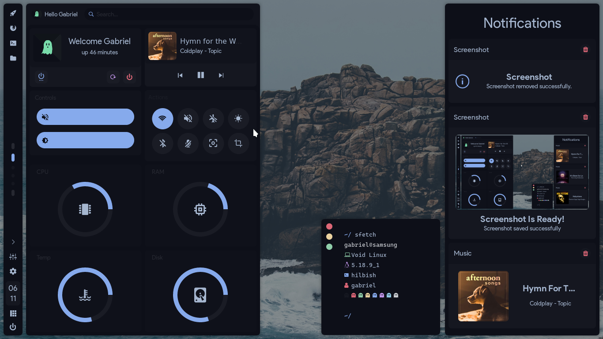
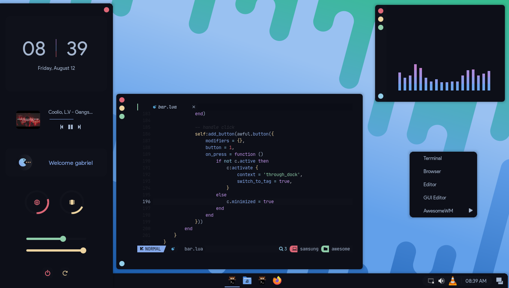
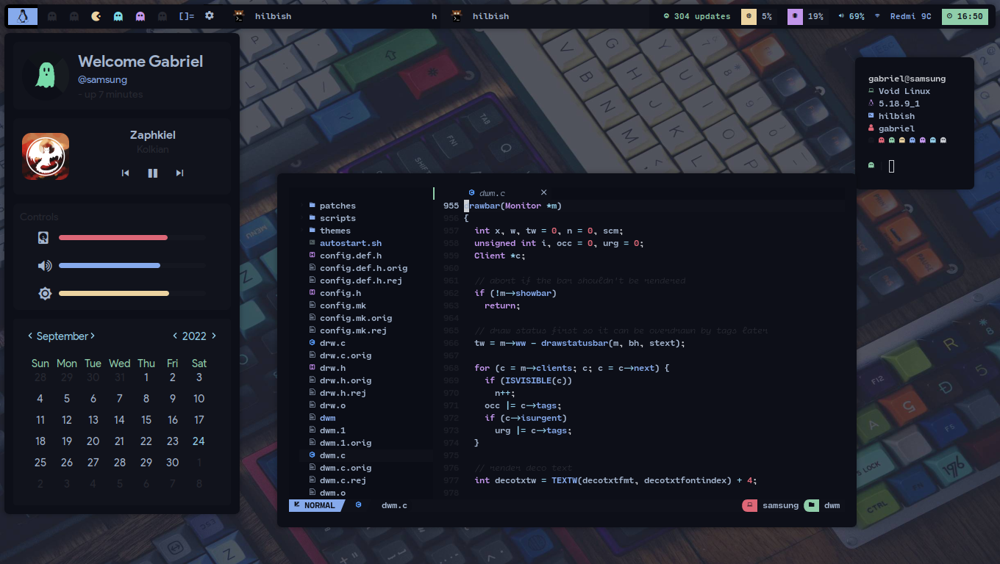
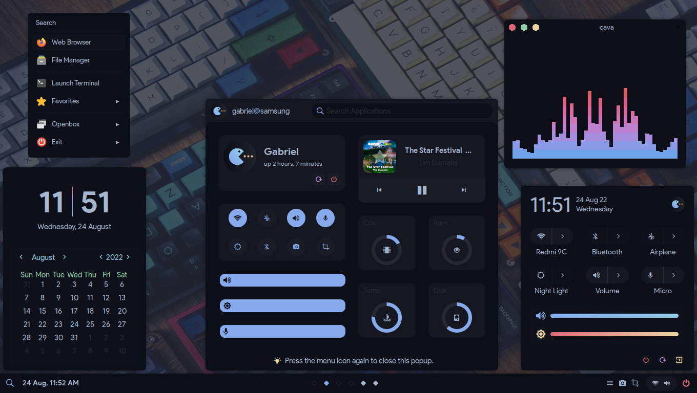
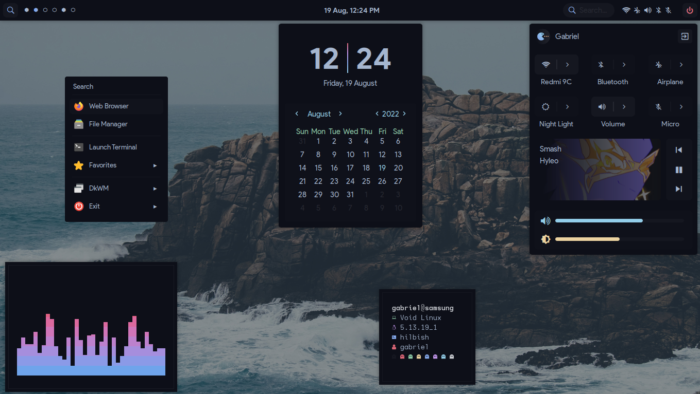
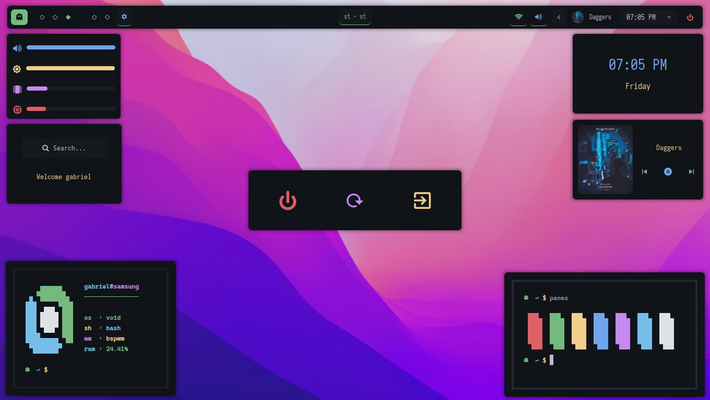

# AlphaTechnolog's dotfiles!

First of all, thanks for dropping by! here is my dotfiles repo, configurations that i'm making (rices)
for make my own setup and feel comfy while i'm working (and beeing productive ofc).

In this repo, I'm sharing with you my rices, and offering you tips/instructions on how this things works
(but in fact, i don't really know how this works, cuz i don't know what I'm doing :/ so good luck :3 lmao).

Also, support could be a bit limited, or maybe late responses on issues, because i'm kinda busy with work
and school :/

> Configurations are in other branches.

<h1>
  
  
</h1>

  

# [1. AwesomeWM (Vertical Version)](https://github.com/AlphaTechnolog/dotfiles/tree/awesomewm-vertical)

# [2. AwesomeWM (Horizontal Version)](https://github.com/AlphaTechnolog/dotfiles/tree/awesomewm)

# [3. Dwm](https://github.com/AlphaTechnolog/dotfiles/tree/dwm)

# [4. Openbox](https://github.com/AlphaTechnolog/dotfiles/tree/openbox)

# [5. DkWM](https://github.com/AlphaTechnolog/dotfiles/tree/dkwm)

# [6. BspWM](https://github.com/AlphaTechnolog/dotfiles/tree/bspwm)

# Ko-Fi

If you really like these setups i'm making mostly in spare time, i would
heavily appreciate a donation (or else a star is heavily appreciated too :D). Thank you for
your support <3 

# Enjoy!

Enjoy with my configs, and remember, if you like at least one of this conf. Please, Smash the star button!
