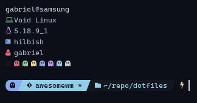

# Hilbish Config (SHELL)

This config aims to be a complete shell configuration with some features that you can love, i'm trying to improve
this more as I can (cuz this is my favourite shell of course).

## How it looks right now!!



## Custom.lua

You can create a new file called custom.lua (or you can leave it like how it's and it should works anyway).
In that file you can define custom aliases or modify your path, in fact, do the things that you want!

An example of a custom.lua that defines custom aliases and modify the path is this:

```lua
local path = require "path"
local aliases = require "aliases"

local custom = {}

function M.setup ()
  path.load_table({
    "~/.nvm/versions/node/v16.15.1/bin",
    "~/.cargo/bin",
    "~/.yarn/bin"
  })

  aliases.load_table({
     duf = "duf -theme ansi",
     icat = "kitty +kitten icat"
  })
end

return custom
```

## TBSM

You can enable the tbsm support too! open your `custom.lua` and type the next:

```lua
local tbsm = require 'tbsm'

local custom = {}

custom.setup = function ()
  tbsm.setup()
end

return custom
```

Just call the `tbsm.setup` method inside the `custom.setup` method (you can have another stuff inside `custom.setup` of course).

## Prompt

For now exists two styles for the prompt: `ghost`, `blocks` or `power_ghost` (power_ghost is the default).
To change the prompt style you can create a file called `rc.lua` and put the next as example:

```lua
local ansikit = require 'ansikit'

return {
    prompt = {
        do_end_line = false, -- append an enter after command execution
        style = 'ghost', -- blocks, ghost or power_ghost (default)
        vim_mode = {
            cursors_case = {
                insert = ansikit.lineCursor,
                others = ansikit.blockCursor,
            },
        }
    }
}
```

That should remove the space between commands and change the prompt style to 'ghost' (that's more minimalist than blocks, but don't have support to git yet).

## Default Aliases

The default aliases are:

| **command** | **replacement** |
|--------------|-------------|
|cat|bat or batcat|
|ls|exa --icons|
|la|exa --icons -la|
|tree| exa --icons --tree|
|grep|grep --color=always|

## Custom commands

This config includes some custom commands that can save you a bit of time searching why just one command don't work
in hilbish: `alias`, the alias command doesn't works when you're using the shell mode
of hilbish, e.g, if you type `alias john 'echo doe'` it don't work, but with this config, it works.

I just made a 'command' that adds support to this using `hilbish.alias`, so now, it works! BUT

### Differences between bash alias and my custom hilbish custom alias

In bash you can do things like this:

```sh
alias john='echo doe' 
```

but in with hilbish you should type:

```sh
alias john 'echo doe'
```

just replace the `=` to and space.

## Automatic bat support

In some distros, bat (the enhanced cat), isn't called bat, it's called `batcat`, so i made
an automatic and dynamic alias to solve that, see: [bat.lua](./bat.lua)

## Enjoy!

Hope you like this :D
